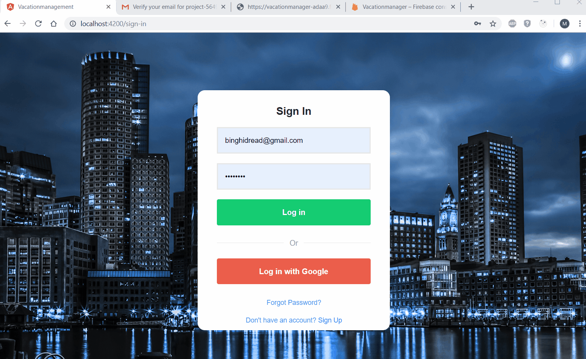

# Invenshure - Vacationmanagement

## Getting Started

- git clone (https://github.com/martonszel/Vacationmanagement)
- cd vacationmanagement/

## Prerequisites

Step 1 
- Angular-CLI is hosted as a node_module and to install and use it you’ll need NodeJS and it’s package manager named npm / Node Package Manager /

- To install NodeJS, navigate to the Downloads Section of the NodeJS’ website, download and install the Installer, best supported by your OS.

Step 2 
- `npm install -g @angular/cli`

Step 3
- `npm i ` - To install the dependencies 

Step 4 
- `ng serve --open` - The ng serve command should start a development server on your locahost port 4200, so if you go to your browser and enter the following url: http://localhost:4200 

## Project 

- Create user registration form , use localstorage, delete user  

- Modify  

